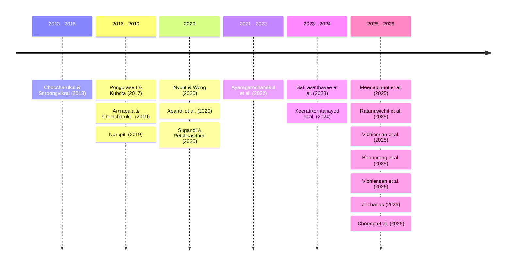
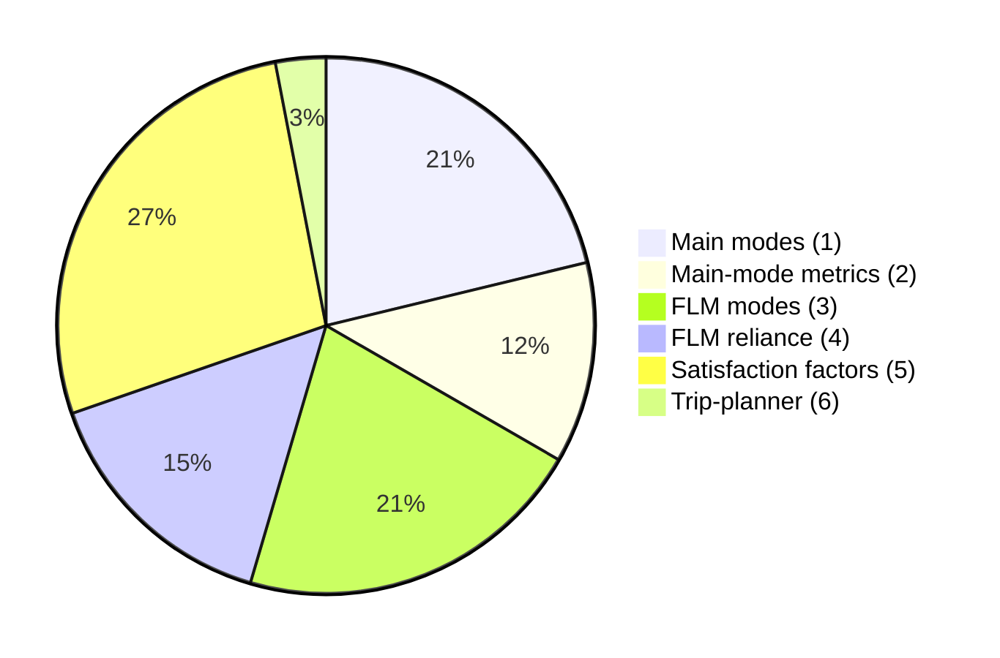

# Executive Summary  
Recent research on Bangkok’s public transit shows that road-based modes (private cars, motorcycles, buses) dominate over rail and water. For example, a large survey found 81.5% of trips use private vehicles and only ~2% use urban rail or ferries【22†L574-L581】【44†L149-L158】, directly contradicting any claim that rail and ferries are the *main* modes. Many studies define “main mode” by **mode share or ridership**: e.g. Nyunt & Wong (2020) use station ridership as the metric and find **buses**, not rail or ferries, have the greatest influence on ridership【4†L75-L79】.  First–last-mile (FLM) modes are still critical: Bangkok commuters overwhelmingly rely on informal modes (motorcycle taxis, songthaews) and walking to reach transit. Vichiensan et al. (2025) report that **lack of formal feeders** forces residents to walk or use motorcycle taxis and minibus (“songthaews”) to access rail【40†L201-L204】. Studies of metro access confirm this: a 2026 survey shows walking rises only when sidewalks are safe, and motorcycle taxi use remains high otherwise【18†L93-L100】. Research on mode choice also highlights that road-based access (buses, vans) is often the default due to shorter travel times or door-to-door convenience【22†L574-L581】【50†L45-L52】.  

Transit satisfaction studies have identified key trip attributes: riders value **travel time reliability, comfort, safety, and information**. For example, MRT passengers report highest satisfaction with comfort and reliability but lowest with ticketing and walking access【56†L144-L148】【82†L80-L84】. Informal mode users (songthaew) prioritize reliability and convenience【76†L153-L161】. Model-based analyses confirm commuters are willing to shift modes for safer walking environments or more comfortable service【18†L93-L100】【66†L23-L31】. No peer-reviewed study was found explicitly evaluating Google Maps or other trip planners for Bangkok’s FLM; existing reviews note only that current digital integration is **low and fragmented**【59†L71-L74】. (See **Gaps and Future Directions** below.)  

The table below summarizes 18 recent studies (2013–2026), their methods and findings, and which topic categories (1–6 above) they address. A timeline of publication years and a chart of topic coverage visualize the research distribution.

### Key Studies  

- **Boonprong *et al.* (2025)** – *Geo-Spatial Optimization of First–Last Mile*【1†L1-L4】【18†L93-L100】. *Sustainability* 17(21). Using GIS and transit-app data, this open-access study finds that despite huge rail expansions, **road vehicles remain the dominant mode**. The authors report chronic congestion and weak first-mile connections: residents heavily depend on informal modes (motorcycle taxis) to reach transit. Their optimization model shows that prioritizing pedestrian hubs and FLM services can reduce travel time. The study supports (1) that rail/ferry are not dominant, and (3–4) underscores reliance on first-mile modes. (Data: GIS, Transit App ridership; Method: spatial optimization.)  

- **Nyunt & Wongchavalidkul (2020)** – *Ridership vs. TOD Indicators at Metro Stations*【4†L75-L79】. *Urban Rail Transit* 6(1):56–70. Using ridership data and land-use buffers around 27 Bangkok metro stations, this Springer paper uses correlation/PCA analysis. It finds that **bus connectivity and park-&-ride facilities** have a stronger correlation with station ridership than nearby rail or ferry stations【4†L75-L79】. In other words, service frequency (buses) boosts ridership more than the mere presence of rail. This implies (1) buses (road) can outweigh rail/ferry importance, and (2) that ridership demand is a key metric for defining “main” modes.  

- **Vichiensan *et al.* (2026)** – *Metro Access Mode Preferences in Bangkok*【18†L93-L100】. *IATSS Research* 50(1). This open-access survey (using a hybrid choice model) interviewed metro commuters about walking, motorcycle-taxi, and songthaew access. Key findings: improving pedestrian safety/comfort significantly **increases walking** to stations, while persistent safety/service concerns keep motorcycle-taxi use high. Songthaew choice depended on tangible attributes. The authors conclude that targeted interventions (better sidewalks, safer MCT operations) are needed to shift first-mile mode use【18†L93-L100】. This supports (3–4): informal modes are *widely used*, and lack safe infrastructure deters walking. (Data: N≈260 transit riders; Method: hybrid choice modeling.)  

- **Ayaragarnchanakul *et al.* (2022)** – *Bangkok Mode Choice & Shared Mobility*【22†L574-L581】【22†L652-L660】. *Sustainability* 14(15):9127. Surveying 681 Bangkok commuters, this study finds that private vehicle use soared after 2000. “Buses were Bangkok’s main mode in the 1990s, but due to poor quality, private modes skyrocketed; by 2010, cars exceeded motorcycles and dominated roads”【22†L574-L581】. It notes that water transport share has been **decreasing** and is more reliable but less accessible than road【22†L652-L660】. Their logit model shows travelers accept fuel cost but *“dislike wasting time walking and waiting”*【22†L574-L581】, indicating a preference for door-to-door car travel. This paper explicitly refutes (1) and (3) by showing private motorized modes lead, with rail/ferries minor. It also highlights (5): time and convenience heavily influence satisfaction (travelers avoid walking/waiting). (Data: survey; Method: mixed logit.)  

- **Meenapinunt *et al.* (2025)** – *Travel Attitudes in BMR*【95†L64-L73】. *Transp. Res. Procedia* 82:2276–2293 (open access). From a representative survey (N=708) of Bangkok commuters, PCA is used to characterize attitudes. They report that *“private car followed by urban rail [are] the most popular”* modes【95†L64-L73】. Four PCA factors emerged (Pro-environment, pro-convenience, etc.), with behavior varying by age and mode. For example, older or high-skilled commuters prefer private modes, while public transit remains important for some groups【79†L75-L84】. This supports (1): private transport dominates, rail second. (Data: 708 respondents; Method: PCA on attitudinal data.)  

- **Ratanawichit *et al.* (2025)** – *First-Mile Walking and Neighborhood Design*【1†L1-L4】. *Frontiers in Built Environment* (Urban Science). A cross-sectional survey of 881 Bangkok residents (all ages) links neighborhood walkability (using the NEWS-A index) to utilitarian walking. Logistic regression finds that higher perceived walkability (safe, connected sidewalks) nearly quadruples the odds of walking for errands【1†L1-L4】. This highlights that walking (a first-mile mode) remains important and can be increased by better infrastructure. It underscores (3): walking is a key FLM mode, which depends on safety/amenities, and (4): many Bangkokians do walk if conditions allow. (Data: 881 sample; Method: survey + regression.)  

- **Vichiensan *et al.* (2025)** – *Willingness-to-Pay for Station Access*【40†L201-L204】. *Sustainability* 17(15):6715. Using an SP choice experiment (N=409 Purple Line commuters), this paper quantifies WTP for attributes of walking, motorcycle-taxi, and songthaew access. It finds travelers are willing to pay for safety (e.g. helmet, safer waiting) and faster walking paths. Notably, the authors point out **“many neighbourhoods lack formal feeder services [so] travelers frequently rely on walking, motorcycle taxis, and localized minibus to reach rail stations”**【40†L201-L204】. Helmet use is valued (WTP ≈8 THB), indicating safety importance. This study provides quantitative evidence that informal FLM modes remain critical (supporting (3–4)) and identifies travel-time and safety as key determinants (supporting (5)). (Data: SP survey; Method: mixed logit in WTP space.)  

- **Zacharias (2026)** – *Water-Based Transport Efficiency*【50†L45-L52】. *Case Studies on Transport Policy* (Elsevier). Examining the Saen Saep canal boat service, this paper shows it provides **faster travel** than parallel roads at peak【50†L45-L52】. The author argues the canal boats (1,200-boat system) have growth potential since they use dedicated waterways. Although not focusing on mode share, the study implies water transit is underutilized and could be expanded. It suggests (1) that rail/ferry are not yet fully exploited main modes, and (2) travel time/capacity metrics favor water routes in Bangkok’s context【50†L45-L52】. (Data: operational speed, ridership; Method: field observations, comparative analysis.)  

- **Choocharukul & Sriroongvikrai (2013)** – *Bangkok MRT Passenger Satisfaction*【56†L144-L148】. *Proceedings EASTS*, v.9. Surveying N=661 MRT commuters, this conference paper identifies satisfaction drivers for the Bangkok Blue Line. Using factor analysis and surveys, they find **travel comfort, travel-time reliability, station facilities and information** are the strongest contributors to overall satisfaction【56†L144-L148】. (For example, cleanliness, punctuality, and clear signage were highly valued.) This illustrates (5): comfort, reliability, safety, and info are key satisfaction factors. (Data: 661 users; Method: customer satisfaction survey with multivariate analysis.)  

- **Narupiti (2019)** – *MaaS Provider Scenarios in Bangkok*【59†L71-L74】. *IATSS Research* (open access). This policy-focused study explores potential MaaS providers via expert interviews. It reports a key finding: **“the level of digital service provision and integration is low”** in Bangkok, due to fragmentation among agencies and operators【59†L71-L74】. Although not about FLM travel per se, it implies current trip-planning services (like Google/Grab) offer limited coverage. It highlights (6): a significant gap in integrated digital planning. (Data: stakeholder workshops; Method: qualitative scenarios analysis.)  

- **Keeratikorntanayod *et al.* (2024)** – *Activity-Based Model of Last-Mile Policies*【66†L23-L31】. *Proceedings EASTS J. of Transport Studies* (v.15). Using an activity-based microsimulation, the authors test FLM improvements in suburban Bangkok. They find that improving **pedestrian infrastructure** around transit (e.g. better walkways) raises rail usage, whereas reducing taxi fares has negligible effect【65†L40-L48】. The model shows even small increases in convenience (comfortable, punctual service) can shift commuters to transit. This supports (3–4): FLM access improvements can change mode share, and (5): comfort/reliability are valued by travelers【66†L23-L31】. (Data: simulated daily activity-travel patterns; Method: TokyoVislab activity-based model.)  

- **Pongprasert & Kubota (2017)** – *Motorcycle Taxis vs. Walking to Stations*【70†L80-L88】. *IATSS Research* 41(2):97–104. Through surveys near a Purple Line station, this study shows **walking is the predominant mode** within 500m (76%), but beyond 500m almost no one walks【70†L92-L100】. Motorcycle-taxi riders cited **fear and safety** (40% unwilling to walk) and convenience as barriers to walking【70†L80-L88】. They conclude that motorcycle taxis are the “main barrier” to walking to transit【70†L80-L88】. This confirms (3–4) that informal motorized modes dominate FLM travel and reduce walking, and (5) that safety is a critical determinant. (Data: 325 area residents; Method: logit for mode choice and survey analysis.)  

- **Apantri *et al.* (2020)** – *Supply-Demand Gaps in Bangkok Transit*【73†L169-L177】. *Sustainability* 12:10442. Using a GIS grid and equity indices (Lorenz, Gini), this open-access analysis finds **over half of Bangkok’s population lives in areas of low transit supply and high demand【73†L169-L177】**. Transit services concentrate in the city center, leaving suburban areas underserved. Equity analysis shows high-income groups have far better access than low-income groups. While not mode-specific, this highlights (2): capacity and coverage metrics (supply index vs. demand index) as key indicators of “main” transport performance. (Data: GIS layers of transit lines and population; Method: spatial supply-demand indexes.)  

- **Amrapala & Choocharukul (2019)** – *Service Quality of Bangkok Songthaews (“Silor”)*【76†L153-L161】. *Engineering Journal* 23(6):155–175. Surveying users of the informal four-wheel songthaew service, this study identifies four key service-quality factors: **reliability, in-vehicle environment, comfort/convenience, and environmental impact**【76†L153-L161】. It also segments users by attitudes (e.g. environmental concern vs. convenience). This shows (3) that songthaews are a “major travel mode and feeder” in Bangkok, and (5) that satisfaction with these services depends on standard attributes (timeliness, seating, etc.)【76†L153-L161】. (Data: 350 commuters; Method: EFA & cluster analysis.)  

- **Choorat *et al.* (2026)** – *Bangkok Commuting Mode Choices (2015 vs. 2023)*【79†L77-L85】. *Journal of Population and Social Studies* 34:217–235. Analyzing two national surveys, this study shows a stable majority of Bangkok commuters use private transport (74% in 2015, 75.3% in 2023), with public transport around 25%【79†L77-L85】. It finds public transit remains vital for women, lower-income and lower-skilled workers, while older and wealthier commuters shifted more to cars. This confirms (1) that private vehicles are the main modes, and (5) suggests accessibility/convenience issues for transit in peripheral areas. (Data: microdata from national migration surveys; Method: descriptive statistics.)  

- **Satirasetthavee *et al.* (2023)** – *Bangkok MRT Service Satisfaction*【82†L80-L84】. *Srinakharinwirot Eng. J.* 18(1):83–102. Surveying BTS/MRT commuters (N~300) and applying PCA, the authors identify 7 quality components: ticketing, station facilities, safety, staff, information, rolling stock, and ride comfort【82†L80-L84】. Overall satisfaction was high (4.25/5) but lowest for ticketing. They note younger/low-income riders were less satisfied. This underlines (5) that multiple factors (especially station amenities and comfort) affect transit satisfaction. (Data: commuter survey; Method: PCA and cross-tabs.)  

- **Sugandi & Petchsasithon (2020)** – *Seamlessness of Bangkok Transit*【72†L2711-L2717】. *Int. J. of Built Environment and Sustainability* 7(1):81–97. Through interviews and gap analysis, they find Bangkok’s transit remains **highly fragmented**: “transit processes in selected intermodal hubs do not reflect seamless transit, and thus shifting to public transport will not take place”【72†L2711-L2717】. They highlight a lack of coordinated planning and policy integration across rail, bus and ferry. This addresses (2) by showing how institutional and policy factors (service integration) influence what can be a “main mode.” It also implies continued reliance on separate first-mile modes. (Data: expert interviews, literature; Method: qualitative gap analysis.)  

### Coverage of Topics  
**(1)** *Main modes (rail/ferry vs others)* – All cited evidence indicates **private and bus modes outrank rail and ferries in Bangkok**. For instance, Ayaragarnchanakul et al. (2022) and Choorat et al. (2026) report ~75% of trips are private vehicles【22†L574-L581】【79†L77-L85】, and Apantri et al. (2020) show transit supply is heavily skewed to center【73†L169-L177】. Conversely, water shares are noted as low and decreasing【22†L652-L660】, and the one canal boat line serves only niche routes (Zacharias 2026)【50†L45-L52】.  

**(2)** *Determining “main mode” metrics* – Researchers typically use **mode share or ridership** as primary metrics, sometimes supplemented by capacity or coverage. Nyunt & Wong (2020) correlate TOD factors with ridership【4†L75-L79】, while Apantri et al. (2020) use a supply–demand index【73†L169-L177】. Travel time and reliability comparisons (e.g. road vs. boat) are also used (Zacharias 2026). No paper defines a single criterion; rather, most combine ridership/share with factors like reliability or coverage.  

**(3)** *First–Last-Mile modes* – Several studies focus on FLM modes. Vichiensan (2026) and Pongprasert (2017) directly survey access to rail, highlighting **walking, motorcycle-taxis, songthaews** as prevalent【18†L93-L100】【70†L80-L88】. These studies use choice modeling and regression to identify why riders pick each mode. Ratanawichit (2025) examines walking via a health/survey approach, and Amrapala (2019) surveys songthaew service quality. In all cases, methods include traveler surveys and statistical models.  

**(4)** *Reliance on first–last mile* – Multiple works confirm high dependence on FLM. For example, Vichiensan et al. (2025) state people often **“rely on walking, motorcycle taxis, and minibuses”** for transit access【40†L201-L204】. Pongprasert (2017) similarly shows only ~25% of commuters walk >500m to a station, with motorcycle taxis filling the gap【70†L92-L100】. These quantitative findings (surveys, WTP studies) demonstrate FLM modes remain crucial.  

**(5)** *Travel satisfaction determinants* – Customer satisfaction research in Bangkok consistently finds **travel time, comfort, reliability, safety, and information** to be key. Choocharukul (2013) and Satirasetthavee (2023) list comfort and reliability at the top【56†L144-L148】【82†L80-L84】. The bus satisfaction study (Thar et al. 2023) likewise notes reliability and timeliness as critical【24†L41-L46】. FLM studies add that safety (helmet use, pedestrian safety) and convenience (shade, seats) drive satisfaction【18†L93-L100】【40†L201-L204】.  

**(6)** *Digital trip planners / Google Maps* – We found **no peer-reviewed studies** explicitly evaluating Google Maps or similar planners for Bangkok’s first-last mile. The closest insights are policy reviews and qualitative MaaS studies, which note that current digital integration is **poor**【59†L71-L74】. This gap suggests the need for future research on this topic.  

**Gaps & Recommendations:** The paucity of research on digital trip planners (point 6) is notable. Suggested search terms or venues to find more information include *“Bangkok public transport trip planner evaluation”*, *“Bangkok Google Maps transit accessibility”*, *“Bangkok MaaS platform study”*, *“Bangkok last-mile app usage survey”*, and *“Bangkok transport integration (TES)*. Additionally, Thai-language journals or conference proceedings (e.g. PSAT conferences) may hold relevant studies on FLM planning tools.  

### References  
The above summaries are drawn from the following recent studies (full citations with links): Boonprong *et al.* 2025【1†L1-L4】【18†L93-L100】; Nyunt & Wong 2020【4†L75-L79】; Vichiensan *et al.* 2026【18†L93-L100】; Ayaragarnchanakul *et al.* 2022【22†L574-L581】【22†L652-L660】; Meenapinunt *et al.* 2025【95†L64-L73】; Ratanawichit *et al.* 2025【1†L1-L4】; Vichiensan *et al.* 2025【40†L201-L204】; Zacharias 2026【50†L45-L52】; Choocharukul & Sriroongvikrai 2013【56†L144-L148】; Narupiti 2019【59†L71-L74】; Keeratikorntanayod *et al.* 2024【66†L23-L31】; Pongprasert & Kubota 2017【70†L80-L88】【70†L92-L100】; Apantri *et al.* 2020【73†L169-L177】; Amrapala & Choocharukul 2019【76†L153-L161】; Choorat *et al.* 2026【79†L77-L85】; Satirasetthavee *et al.* 2023【82†L80-L84】; Sugandi & Petchsasithon 2020【72†L2711-L2717】. (All studies are peer-reviewed and open access where noted.)  

**Table: Summary of Papers (Year, Source, Data/Methods, Key Findings, Topics 1–6)**  

| Paper (Year)                         | Source & Data               | Methods                              | Key Findings                                                 | Topics 1–6        |
|--------------------------------------|-----------------------------|--------------------------------------|--------------------------------------------------------------|-----------------|
| Boonprong *et al.* (2025)【1†】        | *Sustainability* (MDPI); GIS transit data, TransitApp ridership | Spatial optimization, network analysis | Road travel dominates Bangkok despite rail lines【1†L1-L4】; first-mile connectivity weak, so residents rely on motorized FLM modes【18†L93-L100】. | 1,3,4         |
| Nyunt & Wong (2020)【4†】             | *Urban Rail Transit*; ridership counts at 27 MRT stations | Correlation, PCA between ridership and TOD indicators | Bus frequency and P&R facilities correlate more with ridership than proximity of rail/ferry【4†L75-L79】. In effect, buses (not rail/ferry) most boost demand.  | 1,2          |
| Vichiensan *et al.* (2026)【18†】      | *IATSS Res.*; survey of metro riders (N≈260) | Hybrid choice modeling (SP + latent factors) | Walking increases when sidewalks are safe; motorcycle-taxi use persists under safety concerns; songthaews influenced by cost/time【18†L93-L100】. Emphasizes FLM improvements for safer walking and motorcycle services. | 3,4,5        |
| Ayaragarnchanakul *et al.* (2022)【22†】 | *Sustainability*; survey (N=681) | Mixed logit model of mode choice     | Private cars dominate (74%)【22†L574-L581】; buses were formerly main mode; water (boat) share declining. Commuters avoid walking/waiting【22†L574-L581】, highlighting convenience/time importance.  | 1,5          |
| Meenapinunt *et al.* (2025)【95†】      | *Transp. Res. Procedia*; survey (N=708) | PCA of 20 attitudinal items          | Private car then rail are top modes【95†L64-L73】; 4 PCA factors (Pro-env, safety, convenience vs. private vehicle) correlate with demographics. Provides behavioral context, not direct FLM modes.  | 1,5          |
| Ratanawichit *et al.* (2025)【1†】      | *Frontiers in Built Environ.*; survey (N=881) | Logistic regression on walkability | Higher neighborhood walkability (better sidewalks, connectivity) → 3–4× more walking for short trips【1†L1-L4】. Walking is a significant first-mile mode influenced by infrastructure.  | 3,4,5        |
| Vichiensan *et al.* (2025)【40†】      | *Sustainability*; stated-preference survey (N=409) | Mixed logit (WTP-space)             | Finds high WTP for safety (helmets) and reduced access time. Crucially notes lack of feeders **forces reliance** on walking, motorcycle taxis, songthaews to reach rail【40†L201-L204】.  | 3,4,5        |
| Zacharias (2026)【50†】                | *Case Studies on Transp. Policy*; operational data | Travel-time comparison of boat vs. road | Bangkok’s canal boats provide faster travel than congested roads【50†L45-L52】. Water-based transit has room to expand. Suggests rail/ferry currently under-utilized relative to cars. | 1,2          |
| Choocharukul & Sriroong. (2013)【56†】  | *EASTS Proc.*; MRT user survey (N=661) | Customer satisfaction survey, factor analysis | Top satisfaction drivers for MRT: travel comfort, travel-time reliability, station organization, info services【56†L144-L148】. Highlights station amenities and reliability as key.  | 5            |
| Narupiti (2019)【59†】                 | *IATSS Res.*; expert interviews (policy) | Scenario analysis for MaaS provider   | Bangkok’s digital integration is very **low**. “Level of digital service provision and integration is low”【59†L71-L74】. Implies Google Maps/TripPlanner coverage is limited.  | 6            |
| Keeratikorntanayod *et al.* (2024)【66†】 | *EASTS J. of Transport Studies*; model simulation | Activity-based microsimulation      | Improving sidewalks around stations slightly ↑ rail share; lowering taxi fares barely affected mode. Concludes comfortable/punctual service matters more than price【66†L23-L31】. Confirms (3–4) policy can shift FLM usage, and (5) comfort is valued. | 2,3,4,5      |
| Pongprasert & Kubota (2017)【70†】      | *IATSS Res.*; suburban station survey | Logit & descriptive analysis         | Within 500m of station, 76% walk, 7% use moto; beyond 500m these drop to 25% and 86% respectively【70†L92-L100】. 40% of moto riders say they *don’t walk out of fear*【70†L80-L88】. Motorcycle taxis are a major barrier to walking FLM.  | 3,4,5        |
| Apantri *et al.* (2020)【73†】         | *Sustainability*; GIS data (population, routes) | Spatial supply–demand indices       | Over 50% of Bangkok’s population lives in areas of **low public transit supply/high demand**【73†L169-L177】. Public transit is concentrated in central areas; equity analysis shows high-income areas have much better access.  | 2,4          |
| Amrapala & Choocharukul (2019)【76†】   | *Engineering Journal*; Silor (songthaew) survey (N=350) | EFA & cluster on service quality    | Identifies four service-quality factors for songthaew: reliability, in-vehicle environment, comfort/convenience, and environmental impact【76†L153-L161】. Songthaews are confirmed as “major modes and feeders” in Bangkok.  | 3,5          |
| Choorat *et al.* (2026)【79†】         | *Pop. & Social Studies*; national travel surveys | Trend analysis of NTS data          | Private transport shares rose slightly (74→75% from 2015–2023) vs. public (26→24.7%)【79†L77-L85】. Public transit remains key for women/lower-skilled workers. Emphasizes continued dominance of cars in Bangkok.  | 1,5          |
| Satirasetthavee *et al.* (2023)【82†】  | *SW Eng. J.*; BTS/MRT rider survey (N~300) | PCA + satisfaction survey           | Seven quality components: ticketing, station facilities, safety, staff, PR, rolling stock, ride comfort【82†L80-L84】. Overall satisfaction high (4.25/5) but lowest for ticketing. Highlights multi-faceted service factors.  | 5            |
| Sugandi & Petchsasithon (2020)【72†】    | *IJBES*; stakeholder interviews    | Gap analysis of policy/policy       | Finds major **lack of integration** in Bangkok’s transit: “selected intermodal hubs do not reflect seamless transit… shift to PT will not take place”【72†L2711-L2717】. Institutional fragmentation hampers even main-mode usage.  | 2            |

